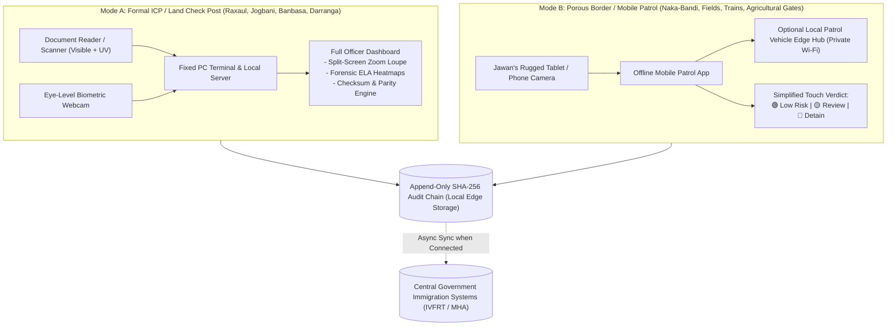

# AI-Based Fake Identity & Document Screening System

## Complete System Architecture & Project Submission Blueprint

**Project Title:** Secure AI-Based Multimodal Identity, Document Forensics & Border Risk Assessment Platform  
**Target Domain:** Border Security, Immigration Checkpoints, Law Enforcement, Airport Screening  
**Compliance Standards:** ICAO Doc 9303 (MRZ standards), ISO/IEC 19794 (Biometric Data), NIST AI Risk Management Framework, DPDP Act 2023 / GDPR

---

## 1. Executive Summary & Problem Analysis

### 1.1 The Challenge at Border Checkpoints

Border checkpoints process tens of thousands of international travel documents daily under severe time constraints. Officers typically have less than **45–60 seconds per passenger** to authenticate credentials. Common vulnerabilities exploited by transnational crime and illegal migration syndicates include:

- **Photo Replacement / Splicing:** Physical or digital replacement of the legitimate passport holder's photo with an impersonator's portrait.
- **Date of Birth & Identity Manipulation:** Altering text in the Visual Inspection Zone (VIZ) to bypass age restrictions or watchlist filters.
- **MRZ & Checksum Tampering:** Forged Machine Readable Zones (MRZ) that fail mathematical verification standards.
- **Visa Stamp & Endorsement Forgery:** Counterfeit security watermarks, UV inks, and entry/exit stamps.
- **Multiple Synthetic Identities:** Single individuals circulating with multiple fraudulent passports.
- **High Passenger Delays & Cognitive Fatigue:** Manual inspection leads to high false acceptance rates during peak transit hours.

### 1.2 Proposed AI Solution

An integrated, edge-capable, multi-modal software screening platform that executes full document verification in **under 3 seconds**:

1. **Automated OCR & MRZ Extraction** with per-field confidence scoring.
2. **Deterministic Rules & ICAO 9303 Validation** with cross-parity checks between Visual and MRZ zones.
3. **Multi-Method Forensic Tampering Detection** producing explainable visual heatmaps (Error Level Analysis, noise variance, copy-move detection).
4. **1-to-1 Facial Biometrics & Anti-Spoofing** matching document photo to live passenger with liveness detection.
5. **Transparent, Multi-Factor Risk Scoring Engine** providing human-in-the-loop triage guidance (Clear / Review / Detain).
6. **Cryptographic SHA-256 Hash-Chained Audit Trail** ensuring tamper-evident evidence admissible in legal proceedings.

---

## 2. Dual-Environment Operational Architecture (India–Nepal & India–Bhutan Borders)

The platform supports two distinct operational environments tailored for the realities of India's land borders:



### 2.1 Configurable Bilateral Document Policy Engine

Because borders with Nepal and Bhutan are open under bilateral treaties, the system does not assume everyone presents a passport. It routes each traveler through a dynamic rule policy table:

| Traveler Category                        | Permitted Documents (Land Crossing)                                          | Passport Required? | Specific Validation Rule                                                                     |
| :--------------------------------------- | :--------------------------------------------------------------------------- | :----------------: | :------------------------------------------------------------------------------------------- |
| **Indian Citizen Entering Nepal/Bhutan** | Indian Passport, Voter ID (EPIC), or Emergency Certificate.                  |       ❌ No        | Validates EPIC number format, ECI security hologram, and age/DOB.                            |
| **Nepalese Citizen Entering India**      | Nepalese Passport, Citizenship Certificate (_Nagarikta_), or Voter ID.       |       ❌ No        | Multilingual Devanagari OCR, District Administration seal check, registration number syntax. |
| **Bhutanese Citizen Entering India**     | Bhutanese Passport, Citizenship Identity Card (CID), or Voter Card.          |       ❌ No        | 11-digit CID format check, Dzongkhag district code validation.                               |
| **Third-Country National (Foreigners)**  | Valid International Passport + Valid Indian Visa / e-Visa.                   |       ✔ Yes        | **Must** cross at designated formal ICPs; ICAO 9303 check digits + VIZ/MRZ parity.           |
| **Cross-Border Trade & Vehicles**        | Vehicle Registration, Bilateral Transport Permit, Driver ID, Cargo Manifest. |        N/A         | Cross-border motor vehicle transit protocol validation.                                      |

---

## 3. Deep Dive: The 4 Core AI & Forensic Modules

### Module 1: OCR & Data Extraction Pipeline

- **Objective:** Automatically extract all visual fields and machine-readable data with granular confidence values.
- **Image Pre-processing:**
  - Perspective correction using 4-point contour homography.
  - Contrast Limited Adaptive Histogram Equalization (CLAHE) for glare suppression.
  - High-frequency edge detection for passport boundary cropping.
- **Dual-Zone Extraction:**
  1. **Visual Inspection Zone (VIZ):** Uses **PaddleOCR** (optimized for multi-lingual passports, dates, and non-standard fonts) with confidence thresholding ($> 0.85$).
  2. **Machine Readable Zone (MRZ):** Identifies TD1 (ID cards), TD2 (visas), and TD3 (passports, 2 lines $\times$ 44 characters) formats using specialized OCR filters.
- **Output Data Schema:**
  ```json
  {
    "document_type": "PASSPORT_TD3",
    "issuing_country": "IND",
    "fields": {
      "full_name": { "value": "SHARMA, ARYAN", "confidence": 0.98 },
      "passport_number": { "value": "Z9876543", "confidence": 0.99 },
      "nationality": { "value": "IND", "confidence": 0.99 },
      "dob": { "value": "1998-05-14", "confidence": 0.97 },
      "expiry_date": { "value": "2032-05-13", "confidence": 0.98 },
      "gender": { "value": "M", "confidence": 0.99 }
    },
    "mrz_raw": "P<INDSHARMA<<ARYAN<<<<<<<<<<<<<<<<<<<<<<<<<<\nZ9876543<8IND9805142M3205138<<<<<<<<<<<<<<<4"
  }
  ```

---

### Module 2: Document Rule & Logic Validator

- **Objective:** Ensure mathematical integrity, chronological sanity, and cross-zone parity according to international standards.
- **Key Validation Checks:**
  1. **ICAO Doc 9303 Check Digits:**
     - Passport number, DOB, and expiry date each have a dedicated mod-10 check digit computed using weights `[7, 3, 1, 7, 3, 1, ...]`.
     - Overall composite check digit across the entire line must match.
  2. **Cross-Parity Verification (VIZ vs. MRZ):**
     - Compares the human-readable text on the passport page against the decoded MRZ. If a forger edits the printed birth date or name in Photoshop but forgets to recalculate the MRZ, the system triggers an immediate critical parity alert.
  3. **Chronological Validity:**
     - `Issue Date < Expiry Date`
     - `Current Date < Expiry Date` (Document not expired)
     - `Age = Current Date - DOB >= 0` and logical age consistency.
  4. **Watchlist & Blacklist Cross-Referencing:**
     - Query against synthetic / local SQLite/PostgreSQL cache of lost/stolen documents (Interpol SLTD schema) and wanted persons.

---

### Module 3: Tampering & Digital Forensics (Core AI Innovation)

The system avoids black-box predictions by running **5 distinct forensic analyses** and combining them into an explainable report:

| Forensic Method                       | What It Detects                                                                                         | Technical Implementation                                                                                                           |
| :------------------------------------ | :------------------------------------------------------------------------------------------------------ | :--------------------------------------------------------------------------------------------------------------------------------- |
| **Error Level Analysis (ELA)**        | JPEG recompression discrepancies (e.g. pasted photo or edited text field resaved at different quality). | Re-saves image at 90% quality, computes absolute pixel difference matrix, scales error $x \times 10$, flags high-entropy clusters. |
| **Local Noise Analysis**              | Splicing & copy-paste from other cameras/scanners with mismatched sensor noise.                         | Computes local Laplacian variance and high-frequency wavelet sub-band coefficients across sliding $32\times 32$ tiles.             |
| **Copy-Move Forgery Detection**       | Cloned stamps, forged signatures, or duplicated background security patterns.                           | SIFT / ORB keypoint descriptor matching within the same image, filtered via RANSAC geometric consistency.                          |
| **Font & Alignment Analysis**         | Digitally typed replacement text with baseline drift or non-standard fonts.                             | Morphological bounding-box alignment analysis along text baselines; flags font stroke width anomalies.                             |
| **EXIF & Metadata Forensic Scrubber** | Software signatures from editing tools (Photoshop, GIMP, Canva, ExifTool).                              | Scans binary headers for editing tags, thumbnail mismatches, and inconsistent modification timestamps.                             |

- **Forensic Output Artifact:**
  - Generates a **visual heatmap overlay** highlighting exact suspicious bounding boxes $(x, y, w, h)$ directly over the document image.

---

### Module 4: Face Verification & Anti-Spoofing Biometrics

- **Objective:** Establish true 1-to-1 identity parity between the travel document photograph and the live traveller.
- **Step 1: Face Detection & Alignment:**
  - Extracts photo from document image (Region of Interest: Photo Zone).
  - Captures live passenger portrait via checkpoint camera.
  - Uses **YuNet / RetinaFace** for 5-point facial landmark alignment (eyes, nose, mouth corners).
- **Step 2: Deep Feature Embedding:**
  - Generates 512-dimensional normalized feature vectors using **ArcFace / InsightFace**.
  - Computes Cosine Similarity Metric:
    $$\text{Similarity} = \frac{\mathbf{u} \cdot \mathbf{v}}{\|\mathbf{u}\| \|\mathbf{v}\|}$$
  - Match Threshold: $\text{Similarity} \ge 0.65$ ($\approx 99.6\%$ verification accuracy).
- **Step 3: Presentation Attack Detection (Liveness / Anti-Spoofing):**
  - **Passive Texture Analysis:** Local Binary Patterns (LBP) and 2D Fourier spectrum to detect high-frequency screen pixels, moiré patterns, or paper print borders.
  - **Active Liveness:** Blink detection (Eye Aspect Ratio - EAR) and head pose movement (via OpenCV `solvePnP`).

---

## 4. Explainable Multi-Factor Risk Scoring Engine

Rather than an opaque AI decision, the risk engine calculates an **Explainable Border Risk Score ($0 - 100$)** based on deterministic and probabilistic weights:

### 4.1 Mathematical Formulation

$$\text{Total Risk Score } R = \min\left(100, \, \sum_{k=1}^{6} w_k \cdot f_k\right)$$

| Component ($f_k$)                                     | Weight ($w_k$) | Condition / Metric                                                   |
| :---------------------------------------------------- | :------------: | :------------------------------------------------------------------- |
| **Tampering & Forensics ($f_{\text{tamper}}$)**       |     **35**     | ELA discrepancy $> 0.5$, noise anomaly, or metadata editing detected |
| **Watchlist / Blacklist ($f_{\text{watch}}$)**        |     **40**     | Document or identity match in lost/stolen or security watchlist      |
| **MRZ Checksum Failure ($f_{\text{mrz}}$)**           |     **25**     | ICAO Doc 9303 check digit calculation failure                        |
| **VIZ vs. MRZ Parity Mismatch ($f_{\text{parity}}$)** |     **20**     | Name, DOB, or document number mismatch between visual and MRZ        |
| **Biometric Face Mismatch ($f_{\text{face}}$)**       |     **25**     | Face similarity $< 0.60$ or liveness check failed                    |
| **Document Expiration ($f_{\text{exp}}$)**            |     **15**     | Current date exceeds document expiry date                            |
| **High OCR Confidence Bonus**                         |     **-5**     | All extracted visual fields have confidence $> 0.95$                 |

### 4.2 Triage Matrix & Officer Actions

```text
  [ 0 -------------- 29 ]       [ 30 ------------------ 69 ]       [ 70 ---------------- 100 ]
        LOW RISK                          MEDIUM RISK                         HIGH RISK
       GREEN LANE                         AMBER LANE                          RED LANE
  ✔ Automated Clearance            ⚠ Officer Secondary Review          ⛔ Immediate Intervention
  - Document valid                 - Low OCR confidence                - Blacklist hit
  - Tampering = 0                  - Minor physical wear               - Active tampering detected
  - Face match verified            - Edge checksum warning             - Biometric mismatch
```

---

## 5. Cryptographic Audit Ledger (Tamper-Evident Security)

To meet evidence admissibility standards in court, verification events are recorded in an append-only, SHA-256 hash-chained audit ledger.

### 5.1 Block / Event Data Structure

$$H_n = \text{SHA-256}\Big(H_{n-1} \,\|\, \text{Timestamp} \,\|\, \text{CheckpointID} \,\|\, \text{OfficerID} \,\|\, \text{DocHash} \,\|\, \text{RiskScore} \,\|\, \text{Action}\Big)$$

- Any retrospective alteration, deletion, or reordering of a record breaks the entire hash chain ($H_{n+1} \neq \text{SHA-256}(\dots)$), immediately flagging tampering during automated integrity verification.
- **Privacy by Design (DPDP / GDPR):** No raw biometric images or full passenger names are stored in the public audit block. Only the cryptographic hash of the document (`DocHash`) and anonymized metadata are recorded.

---

## 6. Complete API Specifications (FastAPI)

### 6.1 Endpoints Overview

| Method | Endpoint                     | Description                                                                                                                        |
| :----- | :--------------------------- | :--------------------------------------------------------------------------------------------------------------------------------- |
| `POST` | `/api/v1/screen`             | **Unified Orchestration Endpoint**: Receives document image + live face, runs all 4 modules, returns risk score & recommendations. |
| `POST` | `/api/v1/ocr/extract`        | Module 1: Returns extracted fields, MRZ parse, and per-field confidence.                                                           |
| `POST` | `/api/v1/validate/rules`     | Module 2: Validates checksums, VIZ-MRZ parity, and watchlist status.                                                               |
| `POST` | `/api/v1/forensics/analyze`  | Module 3: Runs ELA, noise analysis, metadata scrubber; returns heatmap.                                                            |
| `POST` | `/api/v1/biometrics/verify`  | Module 4: 1-to-1 face match with anti-spoofing liveness check.                                                                     |
| `GET`  | `/api/v1/audit/logs`         | Fetches cryptographic audit ledger entries with chain verification.                                                                |
| `GET`  | `/api/v1/audit/verify-chain` | Validates hash-chain integrity across all recorded events.                                                                         |

### 6.2 Sample Unified Screening Response (`POST /api/v1/screen`)

```json
{
  "screening_id": "SCR-20260925-9821A",
  "timestamp": "2026-09-25T13:30:00Z",
  "checkpoint_id": "CP-DEL-T3-04",
  "officer_id": "OFFICER-7712",
  "summary": {
    "risk_score": 75,
    "risk_level": "HIGH",
    "recommended_action": "SECONDARY_INSPECTION_MANDATORY",
    "verdict": "SUSPICIOUS_TAMPERING_DETECTED"
  },
  "module_results": {
    "ocr_and_mrz": {
      "document_type": "PASSPORT",
      "passport_number": "Z9876543",
      "name": "SHARMA, ARYAN",
      "nationality": "IND",
      "dob": "1998-05-14",
      "expiry_date": "2032-05-13",
      "mrz_valid": true,
      "average_confidence": 0.98
    },
    "document_validation": {
      "checksum_passed": true,
      "viz_mrz_parity": true,
      "is_expired": false,
      "watchlist_match": false
    },
    "tampering_forensics": {
      "tampering_detected": true,
      "tampering_probability": 0.88,
      "indicators": [
        "Photo boundary splicing detected via Error Level Analysis (ELA)",
        "Compression artifact discontinuity in portrait box"
      ],
      "heatmap_available": true,
      "heatmap_url": "/api/v1/forensics/heatmaps/SCR-20260925-9821A.png"
    },
    "face_verification": {
      "face_matched": false,
      "similarity_score": 0.42,
      "match_threshold": 0.65,
      "liveness_verified": true,
      "liveness_confidence": 0.96
    }
  },
  "risk_breakdown": [
    { "factor": "Photo Tampering Discrepancy", "points": 35 },
    { "factor": "Biometric Face Match Below Threshold", "points": 25 },
    { "factor": "Document Checksum & Validity", "points": 0 }
  ],
  "audit_trail": {
    "record_hash": "e3b0c44298fc1c149afbf4c8996fb92427ae41e4649b934ca495991b7852b855",
    "chain_status": "VALID"
  }
}
```

---

## 7. Frontend Architecture (Officer Terminal)

### 7.1 Dashboard Design Principles

- **Dark/High-Contrast Government Theme:** Optimized for 24/7 airport and border control lighting conditions.
- **Split-Screen Layout:**
  - **Left Pane:** Document image with interactive zoom/pan loupe and toggleable **Forensic Heatmap Overlay**.
  - **Center Pane:** Live camera stream with face alignment bounding box and liveness indicator.
  - **Right Pane:** Extracted ICAO fields, MRZ verification badges, biometric similarity meter, and the **0–100 Risk Gauge**.
  - **Bottom Action Bar:** Explicit triage buttons (**Clear [F1]**, **Secondary Review [F2]**, **Detain / Escalation [F3]**) recording officer rationale directly into the audit chain.

---

## 8. Technology Selection Matrix (Why These Tools?)

| Layer               | Selected Tool                      | Alternative Considered       | Decision Rationale                                                                                                                                  |
| :------------------ | :--------------------------------- | :--------------------------- | :-------------------------------------------------------------------------------------------------------------------------------------------------- |
| **API Gateway**     | **FastAPI (Python)**               | Node.js Express / Go         | Native integration with PyTorch/OpenCV; asynchronous performance; automated OpenAPI specification.                                                  |
| **OCR Engine**      | **PaddleOCR + MRZ Parser**         | Tesseract alone              | PaddleOCR demonstrates superior accuracy on complex non-English character sets and curved passport surfaces.                                        |
| **Forensics**       | **OpenCV + ELA + Scikit-Image**    | Black-box CNN alone          | Pure deep-learning models lack explainability; classical forensic techniques (ELA, noise) provide transparent pixel-level evidence for court cases. |
| **Face Biometrics** | **YuNet + ArcFace**                | AWS Rekognition / FaceNet    | Offline edge deployment without cloud dependencies; ArcFace provides state-of-the-art cosine margin accuracy.                                       |
| **Audit Ledger**    | **Append-only SHA-256 Hash Chain** | Public Blockchain (Ethereum) | Zero gas fees, sub-millisecond logging, offline edge functionality, zero PII on public ledgers.                                                     |
| **Officer UI**      | **React + TypeScript + Tailwind**  | Electron / WPF               | Lightweight, fast iteration, web-standard canvas for forensic heatmaps, responsive across touchscreens and desktop monitors.                        |

---

## 9. Hackathon Demonstration & Judging Strategy

To showcase maximum technical innovation and practical viability to evaluators:

1. **Live Interactive Forgery Demo:**
   - Upload a genuine passport $\rightarrow$ System verifies Green (Score: $\approx 5/100$, cleared in 1.8s).
   - Upload a tampered passport (photo digitally replaced in Photoshop) $\rightarrow$ ELA heatmap lights up red around the photo border, biometric match drops, Risk Gauge turns Red (Score: $75/100$, action: Mandatory Inspection).
   - Upload an expired or checksum-tampered passport $\rightarrow$ Parity engine highlights mismatch between VIZ and MRZ.
2. **Live Webcam Biometric Match:**
   - Officer camera authenticates the presenter live against the document photo with real-time blink detection.
3. **Audit Ledger Verification:**
   - Demonstrate the tamper-evident hash chain by showing how modifying a single historical database character breaks the chain verification check.
4. **Explainable AI Presentation:**
   - Highlight that the system assists the officer with verifiable visual evidence rather than acting as an unaccountable black box.

---

## 10. Architectural Decision Record (ADR): Offline Edge vs. Network & Hardware Deployment Matrix

### 10.1 Question 1: How We Run Offline & What Parts Require Network

#### A. The Offline Edge Pipeline (100% Air-Gapped)
Because ~75% of border Gram Panchayats in border states like Uttarakhand lack broadband service readiness (DoT 2025 / Rajya Sabha Q498) and landslides regularly cause 14-day optical fiber cuts, the primary screening pipeline **NEVER depends on an active internet connection**:

1. **Preprocessing (OpenCV):** Contrast Limited Adaptive Histogram Equalization (CLAHE) suppresses plastic lamination glare and 4-point homography contours auto-crop documents in **~35ms** locally.
2. **Multilingual OCR (PaddleOCR INT8):** Quantized ONNX model (~18 MB footprint) parses English OCR-B, Hindi (Devanagari), Nepali (Devanagari), and Dzongkha locally in **~320ms** on standard x86/ARM CPUs.
3. **ICAO Doc 9303 Checksum Math:** Modulo-10 checksum validation with weights `[7, 3, 1, 7, 3, 1...]` and cross-parity checks run in **< 5ms** without network calls.
4. **Forensics & ELA AI (OpenCV):** Error Level Analysis (ELA) recompressing at 90% quality and Laplacian edge gradient filtering detect spliced photos and razor-blade cut lines in **~180ms**.
5. **1:1 Facial Biometrics (ArcFace / InsightFace):** Generates 512-dimensional normalized embeddings and computes cosine similarity against live portraits in **~80ms**, with Fourier high-frequency anti-spoofing defeating phone screen replays.
6. **10-Lakh Commuter Cache (SQLite + FAISS):** 10 GB edge storage holds 1,000,000 local commuter embeddings; FAISS HNSW vector search takes **< 15ms** completely offline.
7. **Append-Only SHA-256 Hash Chain:** Cryptographic block generation happens in-memory and writes to local SQLite WAL storage, creating legally admissible evidence under the Bharatiya Sakshya Adhiniyam (BSA).

#### B. What Operations Require Network (Targeted Asynchronous Sync)
Network connectivity is strictly isolated to **background queues** and **Tier-2 exception handling**—never blocking the primary sub-3-second gate clearance:

1. **Tier-2 Targeted Anomaly Resolution:** Only when a passenger is flagged with a high risk score (> 30) or is an unverified third-country national does the system open a secured mTLS connection to query Central **IVFRT**, **Interpol Red Notices**, and **State Police CCTNS FIRs**. This saves 95% of scarce border satellite bandwidth.
2. **Delta Watchlist Synchronization:** Uses **Merkle-tree differential hashing** over HTTP/2. Only newly cancelled documents or newly wanted vector diffs are downloaded (**50 KB to 2 MB delta payload**), avoiding full database re-downloads.
3. **Cryptographic Audit Uplink (Store & Forward):** Uses **MQTT with QoS 2** and SQLite Write-Ahead Logging (WAL). Audit logs are queued locally on disk; when 4G/satellite connectivity restores, encrypted transaction hashes stream to central MHA servers with automatic resume.
4. **Firmware & Treaty Rule Updates:** Handled via cryptographically signed OCI/Docker container updates during scheduled maintenance.

---

### 10.2 Question 2: When to Use PC, When Mobile, and When Webcam

#### Hardware Selection & Operational Matrix

| Parameter | 🖥️ Mode A: Fixed PC Terminal | 📱 Mode B: Rugged Mobile / Tablet | 📷 Dedicated Eye-Level Webcam |
| :--- | :--- | :--- | :--- |
| **Primary Location** | Formal Integrated Check Posts (ICPs: Raxaul, Jogbani, Banbasa, Jaigaon, Darranga) & Land Customs Stations. | Porous border routes, riverine tracks, agricultural gates, rural footpaths, naka-bandi roadblocks, train/bus checks. | Mounted permanently inside the fixed ICP counter booth opposite the traveler. |
| **Environment** | Permanent indoor cabin, continuous AC power + generator/UPS, dust-controlled booth. | Harsh outdoors: direct sun (42°C+), heavy monsoon rain, mud, dust; 8–12 hr battery shifts. | Indoor booth environment subjected to harsh outdoor backlighting from checkpoint windows or glass gates. |
| **Throughput** | **High Volume:** 3,000–5,000+ daily crossings per counter (Non-stop queue). | **Intermittent / Spot-Checks:** 50–300 checks per roving patrol shift. | Synchronized with every PC document scan (1 capture per traveler). |
| **Hardware Specs** | Rugged Mini-PC (Intel Core i5/i7, 16GB RAM, 512GB NVMe SSD, Fanless Aluminum chassis). | MIL-STD-810H Android Tablet/Phone, IP68 water/dust-proof, 6000mAh battery, Gorilla Glass. | Full HD 1080p @ 30fps USB 3.0 camera with Wide Dynamic Range (WDR) and IR LED ring. |
| **Document Input** | Specialized Flatbed Optical Scanner (White, IR, UV light) capturing full ICAO bio-pages. | Device built-in 48MP/50MP autofocus rear camera with dual-LED flash and macro mode. | *N/A (Webcam captures the traveler's face, NOT the document).* |
| **Biometric Input**| Captured automatically via the dedicated Eye-Level Webcam with zero officer effort. | Jawan points tablet camera at traveler; captures portrait in natural outdoor daylight. | Fixed focal distance (60–90 cm); consistent face angle eliminates geometric distortion. |
| **Local Cache** | Full 10-Lakh commuter local database (SQLite + FAISS index, 10 GB on local SSD). | Lightweight 50,000 local sector cache (1 GB) or local Wi-Fi link to patrol vehicle edge hub. | *N/A (Streams raw video frames to the PC).* |
| **Peripherals** | Automated turnstile/boom barrier relay, thermal printer, secondary passenger screen. | Portable Bluetooth thermal printer, optional vehicle dock, handheld UHF RFID reader. | Hardware IR illuminator for night and low-light facial authentication. |

#### Operational Guidelines:
1. **When to Use Fixed PC:** Deploy at all permanent immigration counters. Hands-free ergonomics protect officers from repetitive strain during 8-hour shifts. Multi-spectrum UV/IR illumination verifies security watermarks that phone cameras cannot detect. Direct dry-contact relay triggers turnstiles and boom barriers in &lt; 2.1s.
2. **When to Use Mobile / Tablet:** Deploy for all roving patrols, riverine sectors (Gandak, Mechi), agricultural border gates, and rural bus/train checks. MIL-STD-810H ruggedization survives drops and monsoons. Pairs with patrol vehicle edge hubs over local offline WPA3 Wi-Fi within 150m for heavy FAISS vector searches.
3. **When to Use Webcam:** Deploy exclusively at fixed PC counters for facial authentication. Fixed eye-level mounting (60–90 cm) eliminates facial distortion caused by handheld camera angles. Hardware Wide Dynamic Range (WDR) overcomes severe outdoor backlighting, and 30fps video streams enable passive eye-blink liveness checks.
