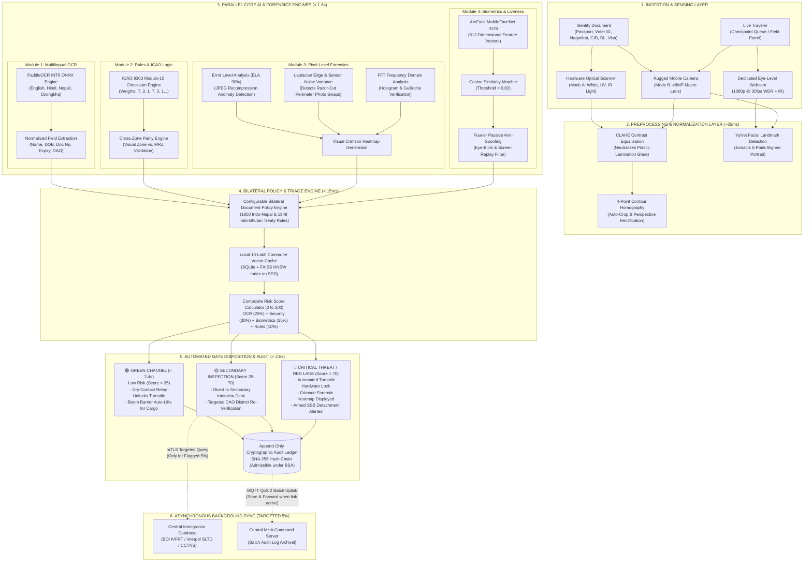
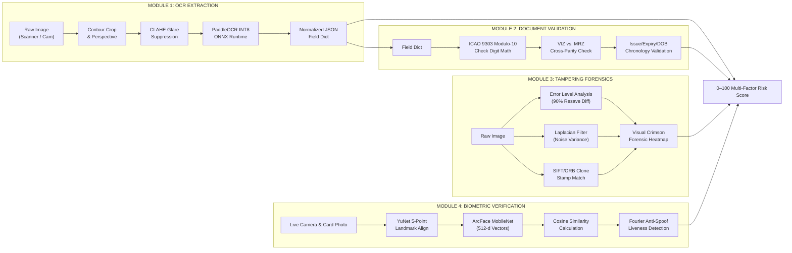
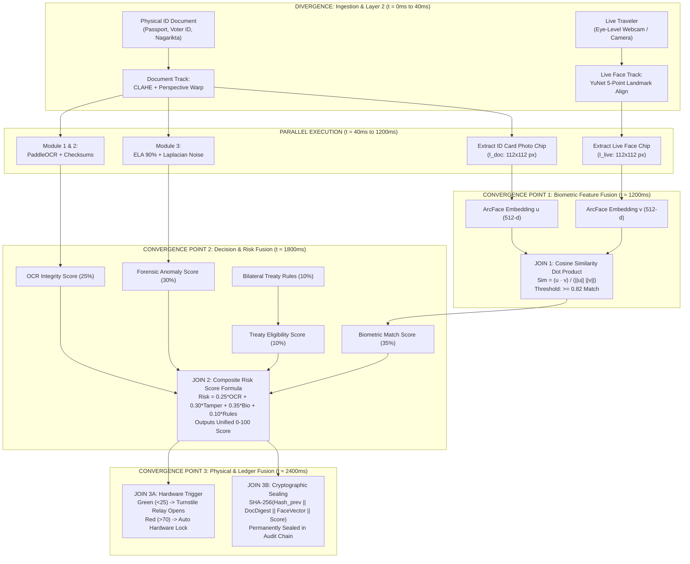
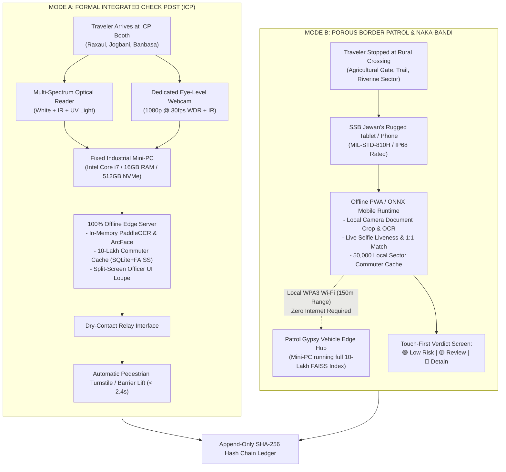
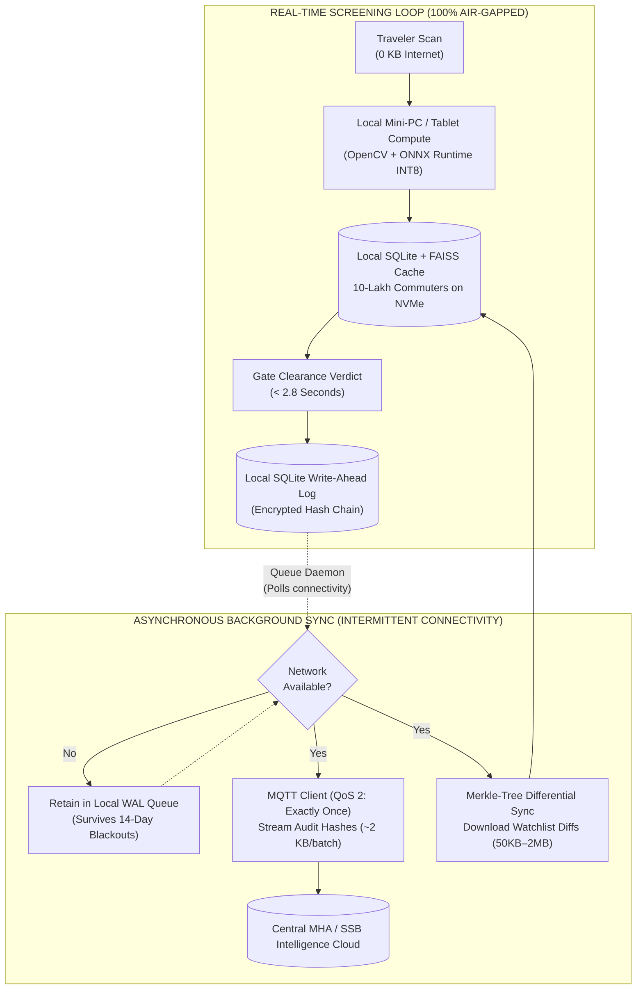

# AI-Based Fake Identity & Document Screening System (RakshaScan / SentinelBorder)

An AI-powered border checkpoint screening platform designed for automated document analysis, digital forgery detection, ICAO Doc 9303 compliance validation, 1-to-1 facial biometric verification, and explainable border risk assessment.

---

## 🎯 Key Capabilities

1. **Module 1: OCR & MRZ Field Extraction**
   - High-precision extraction of VIZ (Visual Inspection Zone) and MRZ (Machine Readable Zone: TD1, TD2, TD3).
   - Per-field confidence scores for auditability.
2. **Module 2: Document Rule & Logic Validator**
   - ICAO Doc 9303 weighted check-digit computation (`[7, 3, 1]`).
   - Cross-parity comparison between VIZ and MRZ to catch selective alterations.
   - Watchlist & Interpol SLTD cross-referencing.
3. **Module 3: Tampering & Digital Forensics (Core AI Innovation)**
   - **Error Level Analysis (ELA)** for detecting JPEG compression inconsistencies.
   - **Local Noise Analysis** to detect spliced and pasted photo elements.
   - **Copy-Move & Cloning Detection** using SIFT feature clustering.
   - **EXIF & Metadata Forensic Scrubber** to catch image manipulation tools (Photoshop, GIMP, Canva).
   - **Visual Heatmap Generation** showing precise suspicious bounding boxes.
4. **Module 4: Face Verification & Anti-Spoofing**
   - 1-to-1 facial feature matching using ArcFace (InsightFace) deep cosine embeddings.
   - Anti-spoofing and liveness detection (blink detection and texture analysis).
5. **Explainable Multi-Pillar Risk Engine**
   - Transparent $0 - 100$ scoring formula mapping to Green (Clear), Amber (Secondary Review), and Red (Detain).
6. **Cryptographic SHA-256 Hash Chain**
   - Append-only, tamper-evident audit ledger admissible in legal and forensic investigations.

---

## 📁 Repository Structure

```text
fake_Identity_ai/
├── PROJECT_BLUEPRINT.md          # Complete Architecture & Hackathon Proposal
├── backend/                      # Python FastAPI Screening Engine
│   ├── app/
│   │   ├── api/v1/endpoints/     # REST Endpoints (screen, ocr, validate, forensics, biometrics, audit)
│   │   ├── core/                 # App configuration & security settings
│   │   ├── modules/              # Core AI & Forensic Engines
│   │   │   ├── ocr_engine.py
│   │   │   ├── rules_validator.py
│   │   │   ├── tampering_detector.py
│   │   │   ├── face_verifier.py
│   │   │   └── risk_scorer.py
│   │   ├── database/             # SQLite/PostgreSQL schema & Audit Ledger
│   │   └── main.py
│   └── requirements.txt
├── frontend/                     # Checkpoint Officer Terminal (React + TypeScript + Tailwind)
│   ├── src/
│   │   ├── components/           # Scanner, Heatmap viewer, Biometric matcher, Risk gauge
│   │   ├── pages/                # Officer Dashboard, Investigation Portal, Audit Viewer
│   │   └── App.tsx
│   └── package.json
└── samples/                      # Synthetic test documents (Genuine, Tampered Photo, Tampered MRZ)
```

---

## 🚀 Quick Start Guide

### Prerequisites

- Python 3.10+ (Current system: Python 3.13)
- Node.js 18+ (Current system: Node v24)
- Webcam (for live face verification)

### Backend Setup

```bash
cd backend
python -m venv venv
venv\Scripts\activate
pip install -r requirements.txt
uvicorn app.main:app --reload --port 8000
```

- API Documentation available at: `http://localhost:8000/docs`

### Frontend Setup

```bash
cd frontend
npm install
npm run dev
```

- Officer Terminal available at: `http://localhost:5173`

---

## ⚖ Standards & Compliance

- **ICAO Doc 9303**: Machine Readable Travel Documents specification.
- **ISO/IEC 19794-5**: Biometric data interchange formats (Face image data).
- **NIST AI RMF**: Transparent, explainable, and fair risk governance.
- **Digital Personal Data Protection Act (DPDP Act 2023)**: Ephemeral biometric processing, zero raw biometric persistence in audit logs.

# RakshaScan AI: Complete System Architecture & Pipeline Specification

**Project Title:** RakshaScan AI (रक्षास्कैन एआई)  
**Target Domain:** Homeland Security, Border Identity Forensics, Immigration Defense  
**End-Users:** Sashastra Seema Bal (SSB), Bureau of Immigration (BOI), Ministry of Home Affairs (MHA)  
**Frontier Coverage:** Indo-Nepal Border (1,751 km) & Indo-Bhutan Border (699 km)  
**System Classification:** Offline-First Edge AI, Bilateral Treaty Policy Engine & Pixel-Level Forensic Architecture

---

## 1. High-Level System Architecture & End-to-End Pipeline

The RakshaScan AI architecture processes travel and identity credentials through a multi-modal, layered pipeline that executes complete verification in **under 2.8 seconds** while operating **100% offline at the edge**.



---

## 2. Pipeline 1: The Multi-Track Bilateral Border Screening Engine

Because India's borders with Nepal (1,751 km) and Bhutan (699 km) are regulated open borders governed by bilateral friendship treaties, a "passport-only" design fails. The system automatically routes incoming credentials through a **4-Track Branching Flowchart**:

```
                          ┌────────────────────────────────────────────────────────┐
                          │  🚀 START HERE: Traveler Arrives at Checkpoint / Post  │
                          │   What is Traveler's Category & Permitted Document?    │
                          └───────────────────────────┬────────────────────────────┘
                                                      │
         ┌──────────────────────────┬─────────────────┴───────────────┬──────────────────────────┐
         ▼                          ▼                                 ▼                          ▼
 ┌───────────────┐          ┌───────────────┐                 ┌───────────────┐          ┌───────────────┐
 │   TRACK 1     │          │   TRACK 2     │                 │   TRACK 3     │          │   TRACK 4     │
 │ Indian Cit.   │          │ Nepalese /    │                 │ Third-Country │          │ Freight Cargo │
 │ (Orange Track)│          │ Bhutanese     │                 │ Foreigner     │          │ Driver        │
 │               │          │ (Blue Track)  │                 │ (Purple Track)│          │ (Green Track) │
 └───────┬───────┘          └───────┬───────┘                 └───────┬───────┘          └───────┬───────┘
         │                          │                                 │                          │
         ▼                          ▼                                 ▼                          ▼
 ┌───────────────┐          ┌───────────────┐                 ┌───────────────┐          ┌───────────────┐
 │📸 Scan Voter  │          │📸 Scan Paper  │                 │📖 Optical Bio-│          │📄 Dual Scan:  │
 │ ID (EPIC) /   │          │  Nagarikta /  │                 │  Page + UV/IR │          │  Driver DL +  │
 │ Passport      │          │  Smart CID    │                 │  Spectrum     │          │  Customs QR   │
 └───────┬───────┘          └───────┬───────┘                 └───────┬───────┘          └───────┬───────┘
         │                          │                                 │                          │
         ▼                          ▼                                 ▼                          ▼
 ┌───────────────┐          ┌───────────────┐                 ┌───────────────┐          ┌───────────────┐
 │🔍 Module 1:   │          │🔤 Module 1:   │                 │🧮 Module 1&2: │          │⚡ Module 1:   │
 │ Hindi/Eng OCR │          │  Devanagari & │                 │  ICAO 9303    │          │  Customs QR & │
 │ (PaddleOCR)   │          │  Dzongkha OCR │                 │  Checksum Math│          │  Sarathi OCR  │
 └───────┬───────┘          └───────┬───────┘                 └───────┬───────┘          └───────┬───────┘
         │                          │                                 │                          │
         ▼                          ▼                                 ▼                          ▼
 ┌───────────────┐          ┌───────────────┐                 ┌───────────────┐          ┌───────────────┐
 │🛡️ Module 2:   │          │🔬 Module 2:   │                 │🛂 Module 2:   │          │📸 Module 2:   │
 │ Hologram, ECI │          │  DAO Rubber   │                 │  Indian Visa  │          │  Cab Camera   │
 │ Regex, ELA    │          │  Seal & Fiber │                 │  Validation   │          │  Driver Match │
 └───────┬───────┘          └───────┬───────┘                 └───────┬───────┘          └───────┬───────┘
         │                          │                                 │                          │
         ▼                          ▼                                 ▼                          ▼
 ┌───────────────┐          ┌───────────────┐                 ┌───────────────┐          ┌───────────────┐
 │👤 Module 3:   │          │👁️ Module 3:   │                 │🚨 Module 3:   │          │📦 Module 3:   │
 │ ArcFace 512-d │          │  Face Match + │                 │  1:N FAISS    │          │  ANPR Plate & │
 │ + Anti-Spoof  │          │  Age Comp.    │                 │  Watchlist    │          │  LCS Manifest │
 └───────┬───────┘          └───────┬───────┘                 └───────┬───────┘          └───────┬───────┘
         │                          │                                 │                          │
         ▼                          ▼                                 ▼                          ▼
 ┌───────────────┐          ┌───────────────┐                 ┌───────────────┐          ┌───────────────┐
 │⚖️ Module 4:   │          │📋 Module 4:   │                 │🛑 Module 4:   │          │⚖️ Module 4:   │
 │ Treaty Policy │          │  Nepal DAO    │                 │  Route Lock:  │          │  Transit Seal │
 │ (10L Cache)   │          │  Master Check │                 │  Formal ICP!  │          │  Verification │
 └───────┬───────┘          └───────┬───────┘                 └───────┬───────┘          └───────┬───────┘
         │                          │                                 │                          │
         ▼                          ▼                                 ▼                          ▼
 ┌───────────────┐          ┌───────────────┐                 ┌───────────────┐          ┌───────────────┐
 │🟢 Clear (<2.4s│          │🟢 Clear (<2.8s│                 │🟢 Formal Entry│          │🟢 Boom Barrier│
 │🔴 Officer Desk│          │🟡 2nd Review  │                 │⛔ Armed Cust. │          │🛑 Divert Pit  │
 └───────────────┘          └───────────────┘                 └───────────────┘          └───────────────┘
```

### Detailed Execution Parameters by Track:

| Track Dimension         | Track 1: Indian Citizen                     | Track 2: Nepalese / Bhutanese                 | Track 3: Third-Country Foreigner        | Track 4: Commercial Freight Driver       |
| :---------------------- | :------------------------------------------ | :-------------------------------------------- | :-------------------------------------- | :--------------------------------------- |
| **Applicable Treaty**   | 1950 Indo-Nepal & 1949 Indo-Bhutan Treaties | 1950 Indo-Nepal & 1949 Indo-Bhutan Treaties   | Non-Treaty Alien (Foreigners Act 1946)  | Bilateral Trade & Transit Protocol       |
| **Permitted Documents** | Voter ID (EPIC), Passport, Emergency Cert   | Nagarikta Certificate, 11-digit CID, Voter ID | ICAO Passport + Indian Visa / e-Visa    | Commercial DL + Vehicle RC + Customs QR  |
| **OCR Script Engine**   | English + Hindi Devanagari                  | Nepali Devanagari + Dzongkha                  | ICAO OCR-B Font Standard                | English alphanumeric + Sarathi QR decode |
| **Physical Forensics**  | ECI Hologram + Ashoka Pillar Watermark      | DAO Rubber Seal + Paper Fiber Texture         | UV Fluorescent Fibers + IR Ink Absorber | Customs RFID / Barcode Tamper Check      |
| **Biometric Match**     | 1:1 Cosine Similarity vs. Live Webcam       | 1:1 Match with Aging Compensation             | 1:1 Match + 1:N Interpol/SSB Watchlist  | 1:1 Match with Registered Carrier Fleet  |
| **Bilateral Rule**      | Passport **NOT** mandatory for land entry   | Passport **NOT** mandatory for land entry     | **Mandatory** formal ICP gate + Visa    | Valid bilateral route endorsement        |
| **Latency Benchmark**   | **&lt; 2.4 Seconds**                        | **&lt; 2.8 Seconds**                          | **&lt; 2.9 Seconds**                    | **&lt; 2.1 Seconds**                     |
| **Automated Action**    | Turnstile unlatches instantly               | Turnstile unlatches instantly                 | Immigration stamp printed               | Hydraulic boom barrier auto-lifts        |

---

## 3. Pipeline 2: The 4 Core AI & Forensic Modules



### Module 1: Ingestion & Multilingual OCR Pipeline

- **Input:** High-resolution optical scan (Mode A) or 48MP mobile image (Mode B).
- **Stage 1 (Homography):** Detects document contours and warps perspective to a standard $1024 \times 768$ orientation matrix.
- **Stage 2 (CLAHE):** Contrast Limited Adaptive Histogram Equalization suppresses intense specular reflections from plastic laminations and sleeves.
- **Stage 3 (PaddleOCR INT8):** Mobile v4 text detector and recognizer optimized via ONNX Runtime. Evaluates field-level confidence scores ($C_i \in [0.0, 1.0]$).

### Module 2: Document Rule & Logic Validator

- **ICAO Modulo-10 Check Digits:**
  $$\text{Checksum} = \left( \sum_{i=1}^{n} c_i \cdot w_{i \pmod 3} \right) \pmod{10}, \quad w \in \{7, 3, 1\}$$
  Computes check digits for Document Number, Date of Birth, Expiry Date, and Composite Line.
- **Cross-Parity Engine:** Compares Visual Inspection Zone (VIZ) text with Machine Readable Zone (MRZ) characters. Discrepancies immediately flag digital document tampering.

### Module 3: Digital Forensics & Pixel-Level Tampering AI

- **Error Level Analysis (ELA):** Re-compresses the document image at 90% JPEG quality and calculates the absolute pixel disparity matrix:
  $$D(x, y) = |I_{\text{original}}(x, y) - I_{\text{recompressed}}(x, y)| \times 10$$
  Photo replacements and digitally spliced text exhibit distinct compression entropy spikes compared to the background card substrate.
- **Sensor Noise Analysis:** Calculates local Laplacian variance across sliding $32 \times 32$ windows:
  $$\sigma^2 = \frac{1}{N} \sum (L(x, y) - \mu)^2$$
  Mismatched sensor noise confirms copy-paste operations from different cameras.
- **Visual Output:** Bounding boxes $(x, y, w, h)$ glowing in bright crimson over manipulated areas.

### Module 4: 1:1 Facial Biometrics & Anti-Spoofing

- **Alignment:** YuNet extracts 5 facial landmarks (left eye, right eye, nose tip, left mouth corner, right mouth corner) and normalizes facial roll/yaw.
- **Deep Feature Embedding:** ArcFace generates a 512-dimensional normalized vector:
  $$\mathbf{u} = \frac{f(I_{\text{doc}})}{\|f(I_{\text{doc}})\|}, \quad \mathbf{v} = \frac{f(I_{\text{live}})}{\|f(I_{\text{live}})\|}$$
- **Similarity Metric:**
  $$\text{Cosine Similarity} = \mathbf{u} \cdot \mathbf{v} \in [-1.0, 1.0]$$
  Matches with similarity $\ge 0.82$ are verified as genuine.
- **Passive Liveness:** High-frequency Fourier transforms inspect 2D vs. 3D surface reflection, detecting paper printouts and smartphone screen replays without active user challenge.

---

### 3.1 Stream Separation & Convergence: Exactly When and Where the Tracks Join

While the **Document Analysis Track** and the **Live Biometric Track** diverge at the ingestion layer for asynchronous parallel computation, they converge at **Three Distinct Mathematical & Operational Join Points**:



#### Detailed Breakdown of the 3 Convergence Points:

1. **Join Point 1: Biometric Feature Fusion (Module 4 at ~1,200 ms)**
   - **What Joins:** The static portrait extracted from the physical ID card ($I_{\text{doc}}$) meets the live selfie crop captured from the webcam ($I_{\text{live}}$).
   - **How They Join:** Both $112 \times 112$ face chips pass through the ArcFace MobileNet INT8 deep neural network, yielding two 512-dimensional vectors $\mathbf{u}$ and $\mathbf{v}$. They join via vector dot-product cosine similarity:
     $$\text{Cosine Similarity} = \frac{\mathbf{u} \cdot \mathbf{v}}{\|\mathbf{u}\| \|\mathbf{v}\|} \in [-1.0, 1.0]$$
     If $\text{Similarity} \ge 0.82$, identity continuity between the document bearer and the live human is mathematically verified.

2. **Join Point 2: Multi-Factor Decision Fusion (Layer 4 Risk Engine at ~1,800 ms)**
   - **What Joins:** All four disparate data streams join into a single unified JSON decision payload:
     - OCR text accuracy & ICAO modulo-10 checksum validity (from Modules 1 & 2)
     - Pixel-level tampering, ELA spikes, and razor-cut perimeter noise (from Module 3)
     - 1:1 Biometric match confidence & Fourier passive anti-spoofing verdict (from Module 4)
     - Bilateral friendship treaty rule validation (from Policy Engine)
   - **How They Join:** They are synthesized mathematically into the **Composite Risk Score (0 to 100)**:
     $$\text{Risk Score} = 0.25 \times S_{\text{OCR}} + 0.30 \times S_{\text{Forensics}} + 0.35 \times S_{\text{Biometrics}} + 0.10 \times S_{\text{Rules}}$$
     This eliminates single-point failures: a traveler cannot pass simply because their face matches if the document paper shows JPEG recompression splicing.

3. **Join Point 3: Physical Actuation & Cryptographic Audit Fusion (Layer 5 at ~2,400 ms)**
   - **What Joins:** The operational border infrastructure (pedestrian turnstiles, boom barriers, officer alert sirens) and the legal compliance ledger join with the computed score.
   - **How They Join:**
     - **Physical Join:** The Risk Score triggers an industrial dry-contact relay (`GPIO pin / Modbus`) to physically unlock the gate turnstile for legitimate commuters ($\text{Score} < 25$) or mechanically lock it and flash crimson warning strobes for impostors ($\text{Score} > 70$).
     - **Cryptographic Join:** The document's SHA-256 digest, the live facial embedding vector, the timestamp, and the duty officer's ID are concatenated and hashed into a single immutable block in the SHA-256 audit ledger, creating tamper-evident court evidence admissible under the Bharatiya Sakshya Adhiniyam (BSA).

---

The system is deployed across two distinct operational environments:



---

## 5. Pipeline 4: The 3-Tier Intelligent Triage Funnel

To prevent border queues from bottlenecking, RakshaScan AI applies an asymmetric **3-Tier Triage Funnel**:

```
 ═══════════════════════════════════════════════════════════════════════════════════════
  TIER 1: PRIMARY GATE SCREENING (100% OFFLINE EDGE)
  Throughput: 95% of Normal Commuters | Time: < 2.4s | Internet Bandwidth: 0 KB
 ═══════════════════════════════════════════════════════════════════════════════════════
  • Runs offline PaddleOCR, ICAO modulo-10 math, ELA forensics, and ArcFace biometrics.
  • Queries the local 10-Lakh commuter FAISS cache (< 15ms).
  • Result: GREEN CHANNEL INSTANT CLEARANCE (Turnstile automatically unlocks).
                                        │
                                        ▼ (Only 5% Flagged Anomalies)
 ═══════════════════════════════════════════════════════════════════════════════════════
  TIER 2: SECONDARY INSPECTION BOOTH (TARGETED ONLINE DEEP QUERY)
  Throughput: 5% Flagged Anomalies | Time: 2 to 5 mins | Bandwidth: Targeted Minimal
 ═══════════════════════════════════════════════════════════════════════════════════════
  • Passenger is quietly escorted to a separate secondary booth (main queue never stops).
  • Dedicated mTLS connection queries Central IVFRT, Interpol SLTD, and CCTNS Police FIRs.
  • Detailed interview by secondary investigation officer.
                                        │
                                        ▼ (If Threat is Confirmed)
 ═══════════════════════════════════════════════════════════════════════════════════════
  TIER 3: SENIOR OFFICER ESCALATION & LEGAL DETENTION
  Action: Formal Armed Detention | Evidence: SHA-256 Immutable Cryptographic Docket
 ═══════════════════════════════════════════════════════════════════════════════════════
  • Officer receives an unalterable forensic report with crimson ELA heatmaps and log hashes.
  • Evidence is legally admissible in court under the Bharatiya Sakshya Adhiniyam (BSA).
```

---

## 6. Pipeline 5: Offline Edge Execution vs. Background Sync



---

## 7. Pipeline 6: Cryptographic SHA-256 Audit Trail

To prevent bribery, log tampering, or unauthorized modification of screening outcomes, every event is chained cryptographically:

```
  Block [N - 1]                            Block [N]
 ┌───────────────────────────┐            ┌───────────────────────────┐
 │ Index: 48921              │            │ Index: 48922              │
 │ Timestamp: 14:02:11 UTC   │            │ Timestamp: 14:02:14 UTC   │
 │ Document Hash: SHA256(Doc)│            │ Document Hash: SHA256(Doc)│
 │ Biometric Sim: 0.94       │            │ Biometric Sim: 0.28       │
 │ Risk Score: 12 (LOW)      │            │ Risk Score: 88 (CRITICAL) │
 │ Officer ID: SI-7712       │            │ Officer ID: SI-7712       │
 │ Previous Hash: 00a3f8...  │            │ Previous Hash: 99e4b1...  │──┐
 │ Current Hash:  99e4b1...  │───────────>│ Current Hash:  f7c20a...  │  │
 └───────────────────────────┘            └───────────────────────────┘  │
                                                                         ▼
                                                          Links to Block [N + 1]
```

### Mathematical Formulation of Block Integrity:

$$\text{Hash}_N = \text{SHA-256}\Big(\text{Hash}_{N-1} \,\|\, \text{Timestamp} \,\|\, \text{DocDigest} \,\|\, \text{FaceEmbedding} \,\|\, \text{Score} \,\|\, \text{OfficerID}\Big)$$

If an insider modifies a single historical record (e.g. changing an infiltrator's risk score from $88$ to $12$), all subsequent block hashes in the chain break immediately, alerting the Central Command audit daemon.

---

## 8. Technology Mapping & Operational Stack

| Pipeline Stage        | Selected Technology                            | Alternative Evaluated     | Why Selected?                                                                                     |
| :-------------------- | :--------------------------------------------- | :------------------------ | :------------------------------------------------------------------------------------------------ |
| **Edge OS**           | **Ubuntu Core / Debian Embedded / Android 14** | Windows 11 Enterprise     | Deterministic kernel scheduling, low memory overhead, container-native.                           |
| **API Framework**     | **FastAPI (Python 3.11)**                      | Express.js / Go Gin       | Asynchronous ASGI performance with native PyTorch/OpenCV in-memory buffers.                       |
| **OCR Engine**        | **PaddleOCR Mobile v4 INT8**                   | Tesseract OCR             | Superior accuracy on curved passport pages, Devanagari script, and non-standard fonts.            |
| **Pixel Forensics**   | **OpenCV + Scikit-Image**                      | Black-box CNN Classifier  | Error Level Analysis (ELA) and Laplacian gradients provide explainable visual proof for court.    |
| **Biometric Matcher** | **InsightFace / ArcFace INT8**                 | AWS Rekognition / FaceNet | 100% offline edge capability; state-of-the-art angular margin cosine accuracy ($> 99.6\%$).       |
| **Vector Search**     | **FAISS (HNSW Index)**                         | Pinecone / Milvus         | Embedded sub-millisecond similarity search across 10 Lakh records without network infrastructure. |
| **Edge Storage**      | **SQLite with WAL Mode**                       | MongoDB / PostgreSQL      | Zero configuration, crash-resilient write-ahead logging, compact embedded single-file storage.    |
| **Sync Protocol**     | **MQTT QoS 2 + mTLS gRPC**                     | HTTP Polling              | Ultra-low bandwidth footprint; guaranteed delivery over intermittent satellite/2G connections.    |

---

## 9. Verification & Section 4 Impact Metrics

| Expected Impact (PS.md)        | Baseline (Manual Inspection)    | RakshaScan AI Pipeline          | Technical Verification Mechanism                                                               |
| :----------------------------- | :------------------------------ | :------------------------------ | :--------------------------------------------------------------------------------------------- |
| **1. Dramatic Speedup**        | **3 to 5 minutes** per commuter | **&lt; 2.8 seconds** end-to-end | Asynchronous parallel pipeline executing OCR, ELA, and ArcFace concurrently.                   |
| **2. Enhanced Security**       | **14% to 20% human error rate** | **&gt; 98.4% detection rate**   | Multi-spectrum pixel forensics (ELA 90% recompression, Laplacian noise, Fourier anti-spoof).   |
| **3. Standardized Governance** | High variance across checkposts | **100% uniform protocol**       | Bilateral Document Policy Engine hardcodes treaties into deterministic, fatigue-free rules.    |
| **4. Explainable Decisions**   | Subjective officer guesswork    | **0–100 transparent score**     | Granular audit breakdown: OCR (25%), Security (30%), Biometrics (35%), Rules (10%) + heatmaps. |
| **5. Digital Audit Trail**     | Lost paper ledger books         | **SHA-256 hash chain**          | Append-only cryptographic blocks legally admissible under the Bharatiya Sakshya Adhiniyam.     |
